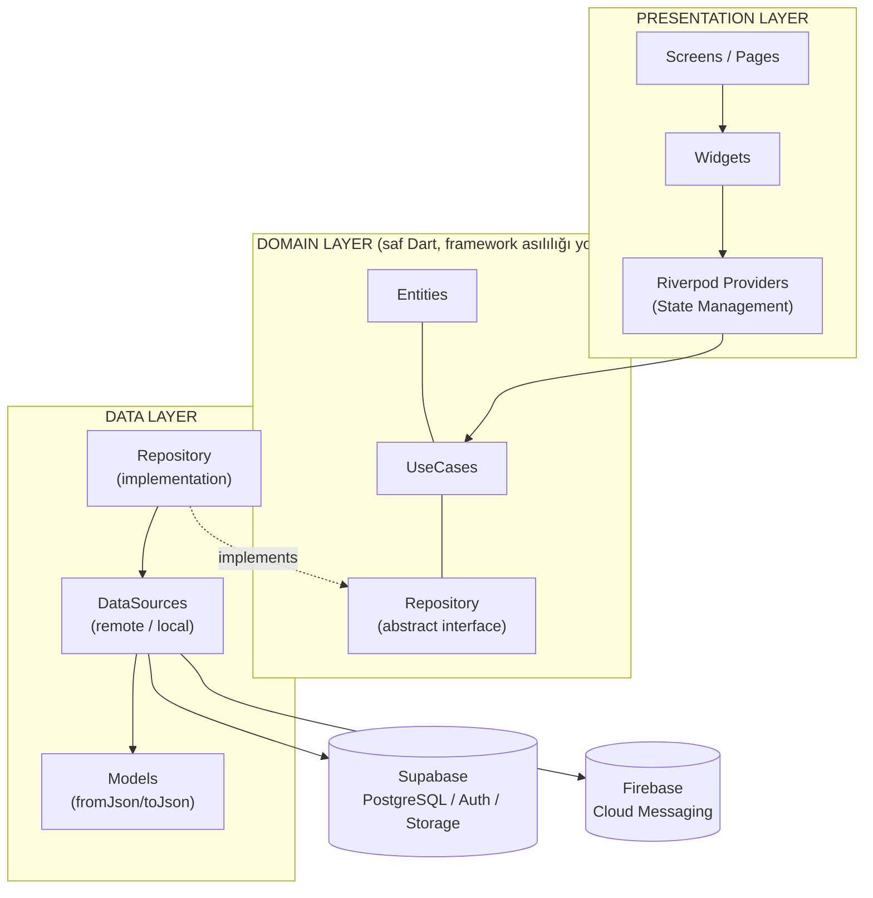
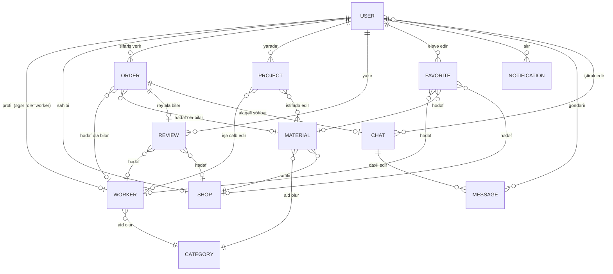
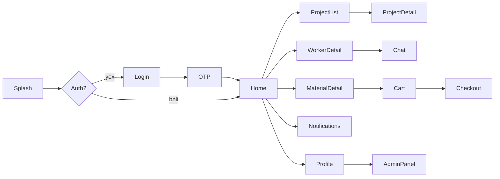

# EXPERT — Texniki Arxitektura Sənədi

**Versiya:** 1.0 (Draft)
**Tarix:** 2026-08-04
**Status:** Təsdiq gözləyir
**Bağlıdır:** [PRD.md](PRD.md)

---

## 1. Arxitektura Prinsipi

Layihə **Feature-First Clean Architecture** üzərində qurulur. Hər feature özündə 3 qatı saxlayır:



**Asılılıq qaydası:** Presentation → Domain ← Data. Domain qatı heç nədən asılı deyil (nə Flutter, nə Supabase). Bu, test edilə bilənliyi və genişlənməni təmin edir.

- **Presentation Layer** — UI, Riverpod provider/notifier-lər, ekran state-i
- **Domain Layer** — Entity-lər, UseCase-lər (biznes qaydaları), Repository interfeysləri (abstract)
- **Data Layer** — Repository implementasiyaları, DataSource-lar (Supabase/Firebase ilə əlaqə), Model-lər (JSON serialization)

---

## 2. Qovluq Strukturu

```
expert_app/
├── lib/
│   ├── main.dart
│   ├── app.dart                          # MaterialApp, root widget
│   │
│   ├── core/                             # Bütün feature-lər üçün ortaq
│   │   ├── config/                       # env, Supabase/Firebase init
│   │   ├── constants/                    # app_constants, asset paths
│   │   ├── errors/                       # Failure, Exception siniflər
│   │   ├── network/                      # Supabase client wrapper, connectivity
│   │   ├── router/                       # go_router konfiqurasiyası
│   │   ├── theme/                        # light/dark ThemeData, colors, typography
│   │   ├── localization/                 # az, en, ru .arb faylları
│   │   ├── usecases/                     # base UseCase<Type, Params> class
│   │   ├── utils/                        # formatters, validators, extensions
│   │   └── widgets/                      # Reusable: AppButton, AppTextField,
│   │                                     #  LoadingIndicator, ErrorView, EmptyState...
│   │
│   ├── features/
│   │   ├── auth/
│   │   │   ├── data/
│   │   │   │   ├── datasources/          # auth_remote_datasource.dart
│   │   │   │   ├── models/                # user_model.dart
│   │   │   │   └── repositories/         # auth_repository_impl.dart
│   │   │   ├── domain/
│   │   │   │   ├── entities/             # user_entity.dart
│   │   │   │   ├── repositories/         # auth_repository.dart (abstract)
│   │   │   │   └── usecases/             # login_with_otp.dart, register.dart...
│   │   │   └── presentation/
│   │   │       ├── providers/            # auth_provider.dart (Riverpod)
│   │   │       ├── screens/              # login_screen.dart, otp_screen.dart
│   │   │       └── widgets/
│   │   │
│   │   ├── home/                         # Axtarış, kateqoriya, banner, populyar-lar
│   │   ├── worker/                       # Usta profili, siyahı, filtr
│   │   ├── material/                     # Materiallar, kateqoriyalar, səbət
│   │   ├── shop/                         # Mağaza profili
│   │   ├── order/                        # Sifariş yaratma/izləmə
│   │   ├── project/                      # Layihə (təmir büdcəsi) modulu
│   │   ├── review/                       # Reytinq/rəy
│   │   ├── chat/                         # Realtime mesajlaşma
│   │   ├── notification/                 # Bildirişlər (FCM)
│   │   ├── favorite/                     # Favoritlər
│   │   ├── profile/                      # İstifadəçi profili/ayarlar
│   │   └── admin/                        # Admin panel (V1.x-də tam aktivləşir)
│   │
│   └── l10n/                             # generated localization
│
├── assets/
│   ├── images/
│   ├── icons/
│   └── fonts/
│
├── test/
│   ├── features/                         # hər feature üçün unit/widget testlər
│   └── core/
│
└── pubspec.yaml
```

**Qeyd:** Hər feature qovluğu yuxarıdakı `auth` nümunəsi ilə eyni 3-qatlı (`data/domain/presentation`) sxemi təkrarlayır — bu, komandanın istənilən feature-də eyni məntiqlə hərəkət etməsini təmin edir.

---

## 3. Feature-lərin Qatlar üzrə Paylanması

| Feature | Domain Entity(lər) | Əsas UseCase-lər (nümunə) |
|---|---|---|
| **auth** | User | LoginWithOtp, VerifyOtp, Register, Logout, GetCurrentUser, ResetPassword |
| **home** | Category, Worker, Material | GetCategories, GetFeaturedWorkers, GetFeaturedMaterials, Search |
| **worker** | Worker, Review | GetWorkerDetail, GetWorkersByCategory, FilterWorkers, GetWorkerReviews |
| **material** | Material, Category, Shop | GetMaterialsByCategory, CompareMaterialPrices, AddToCart |
| **shop** | Shop | GetShopDetail, GetShopMaterials |
| **order** | Order | CreateOrder, GetMyOrders, UpdateOrderStatus, CancelOrder |
| **project** | Project | CreateProject, EstimateBudget, GetMyProjects, UpdateProjectStatus |
| **review** | Review | SubmitReview, GetReviewsForTarget |
| **chat** | Chat, Message | GetChats, SendMessage, ListenToMessages, MarkAsRead |
| **notification** | Notification | GetNotifications, MarkAsRead, RegisterFcmToken |
| **favorite** | Favorite | ToggleFavorite, GetMyFavorites |
| **admin** | User, Worker, Shop | ApproveWorker, ApproveShop, GetPlatformStats |

---

## 4. Entity Modeli (Domain Layer)

Bütün entity-lər **immutable** (Dart `freezed` paketi ilə) olacaq və heç bir Supabase/JSON asılılığı daşımayacaq — bu, Data Layer-dəki Model-lərin işidir (`UserModel extends UserEntity` + `fromJson/toJson`).

### 4.1 User
```
id, phone, email?, fullName, avatarUrl?, role (customer|worker|shopOwner|admin),
preferredLanguage (az|en|ru), isVerified, createdAt, updatedAt
```

### 4.2 Worker (Usta)
```
id, userId (→ User), categoryIds[], bio, experienceYears, priceFrom, priceTo,
serviceAreas[] (rayonlar), portfolioImages[], rating, reviewCount,
isOnline, isApproved, isAvailable, contactPhone
```

### 4.3 Category
```
id, name, nameEn, nameRu, iconUrl, type (worker|material), parentId?
```

### 4.4 Shop
```
id, ownerId (→ User), name, logoUrl, address, rayon, categoryIds[],
rating, isApproved, workingHours
```

### 4.5 Material
```
id, shopId (→ Shop), categoryId (→ Category), name, description, images[],
price, discountPrice?, unit (ədəd|m2|kg...), stockQty, isFeatured
```

### 4.6 Order
```
id, customerId (→ User), targetType (worker|material), targetId, status
(pending|accepted|inProgress|completed|cancelled), totalPrice, address,
scheduledDate?, notes?, createdAt
```

### 4.7 Project
```
id, userId (→ User), title, roomCount?, budgetPlanned, estimatedCost,
status (planning|inProgress|completed), workItems[] (iş+material+usta əlaqəsi),
createdAt, updatedAt
```

### 4.8 Review
```
id, reviewerId (→ User), targetType (worker|shop), targetId, orderId (→ Order),
rating (1-5), comment?, images[], createdAt
```

### 4.9 Favorite
```
id, userId (→ User), targetType (worker|material|shop), targetId, createdAt
```

### 4.10 Chat
```
id, participantIds[2] (→ User), orderId? (→ Order), lastMessageText,
lastMessageAt, createdAt
```

### 4.11 Message
```
id, chatId (→ Chat), senderId (→ User), type (text|image|audio),
content?, mediaUrl?, isRead, createdAt
```

### 4.12 Notification
```
id, userId (→ User), type (newOrder|newMessage|priceDrop|orderConfirmed),
title, body, payload (json), isRead, createdAt
```

---

## 5. Entity-lər Arası Əlaqə Diaqramı



**Qeyd:** `ORDER`, `REVIEW`, `FAVORITE` üçün `targetType`/`targetId` polymorphic əlaqə modelidir (bir sifariş ya usta, ya materiala aid ola bilər) — bu, Supabase-də ayrıca cədvəllər yerinə vahid cədvəldə idarə olunacaq (Mərhələ 3-də ətraflı).

---

## 6. State Management (Riverpod) Yanaşması

- **AsyncNotifierProvider** — server-dən gələn siyahı/detal data üçün (məs. `workerListProvider`)
- **StateNotifierProvider** — form/UI state üçün (məs. login form, filter state)
- **StreamProvider** — realtime data üçün (chat mesajları, order status dəyişikliyi — Supabase Realtime ilə)
- **FutureProvider** — bir dəfəlik async sorğular üçün
- Hər feature öz `providers/` qovluğunda saxlanılır, `core`-da **heç bir** feature-ə özəl provider olmayacaq

---

## 7. Naviqasiya

`go_router` istifadə olunacaq (deep-linking, nested routes, auth guard üçün əlverişlidir):



---

## 8. Reusable / Shared Layer

`core/widgets/` içində layihə boyu təkrar istifadə olunacaq komponentlər: `AppButton`, `AppTextField`, `AppCard`, `RatingStars`, `LoadingIndicator`, `ErrorStateView`, `EmptyStateView`, `AppBottomSheet`, `NetworkImageWithPlaceholder`.

Bu, Mərhələ 4-də (Flutter layihəsinin qurulması) ilk yaradılacaq qovluqlardan biri olacaq ki, bütün feature-lər ondan asılı ola bilsin.

---

## Növbəti Addım

Bu arxitektura təsdiqləndikdən sonra **Mərhələ 3 — Supabase Database Dizaynı** hazırlanacaq: cədvəllər, relations, indexes, RLS (Row Level Security) qaydaları.

> Dəyişiklik lazımdırsa bildirin, əks halda **"Davam et"** yazın.
