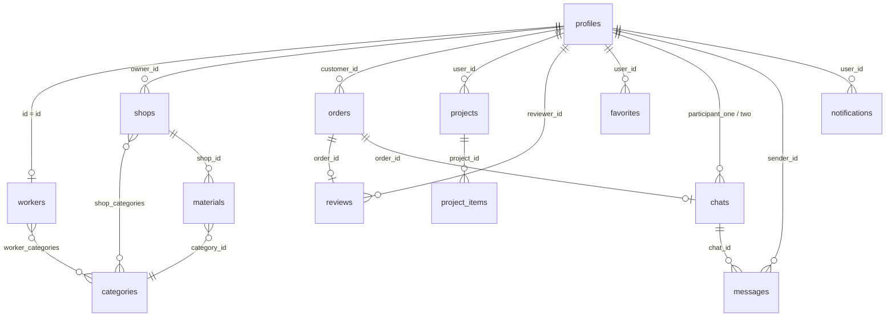

# EXPERT — Supabase Database Dizaynı

**Versiya:** 1.0 (Draft)
**Tarix:** 2026-08-04
**Status:** Təsdiq gözləyir
**Bağlıdır:** [PRD.md](PRD.md) · [ARCHITECTURE.md](ARCHITECTURE.md)

---

## 1. Ümumi Yanaşma

- Supabase Auth `auth.users` cədvəlini avtomatik idarə edir. Bizim `public.profiles` cədvəlimiz ona **1-1** bağlanır (`id` = `auth.users.id`).
- Polymorphic əlaqələr (`orders.target_id`, `reviews.target_id`, `favorites.target_id`) birbaşa FK yerinə `target_type` + `target_id` cütü ilə idarə olunur — Postgres-də birbaşa polymorphic FK dəstəklənmədiyi üçün bu, tətbiq səviyyəsində və trigger yoxlaması ilə təmin olunacaq.
- Bütün cədvəllərdə `created_at timestamptz default now()` var; dəyişkən cədvəllərdə əlavə `updated_at` və avtomatik yeniləmə trigger-i olacaq.
- Hər cədvəldə **RLS (Row Level Security) default olaraq aktivdir** — Supabase-in tövsiyəsinə uyğun.

---

## 2. Cədvəllər (DDL)

### 2.1 `profiles`

```sql
create type user_role as enum ('customer', 'worker', 'shop_owner', 'admin');
create type app_language as enum ('az', 'en', 'ru');

create table public.profiles (
  id uuid primary key references auth.users(id) on delete cascade,
  phone text unique,
  full_name text not null,
  avatar_url text,
  role user_role not null default 'customer',
  preferred_language app_language not null default 'az',
  is_verified boolean not null default false,
  created_at timestamptz not null default now(),
  updated_at timestamptz not null default now()
);

create index idx_profiles_role on public.profiles(role);
create index idx_profiles_phone on public.profiles(phone);
```

> Qeyd: `auth.users` insert olduqda `profiles` sətrini avtomatik yaratmaq üçün `handle_new_user()` trigger funksiyası yazılacaq (aşağıda §4).

---

### 2.2 `categories`

```sql
create type category_type as enum ('worker', 'material');

create table public.categories (
  id uuid primary key default gen_random_uuid(),
  name text not null,
  name_en text,
  name_ru text,
  icon_url text,
  type category_type not null,
  parent_id uuid references public.categories(id) on delete set null,
  created_at timestamptz not null default now()
);

create index idx_categories_type on public.categories(type);
create index idx_categories_parent on public.categories(parent_id);
```

---

### 2.3 `workers` (Usta profili — `profiles`-in genişlənməsi)

```sql
create table public.workers (
  id uuid primary key references public.profiles(id) on delete cascade,
  bio text,
  experience_years int default 0,
  price_from numeric(10,2),
  price_to numeric(10,2),
  service_areas text[] default '{}',
  portfolio_images text[] default '{}',
  contact_phone text,
  rating numeric(3,2) not null default 0,
  review_count int not null default 0,
  is_online boolean not null default false,
  is_available boolean not null default true,
  is_approved boolean not null default false,
  created_at timestamptz not null default now(),
  updated_at timestamptz not null default now()
);

create index idx_workers_is_approved on public.workers(is_approved);
create index idx_workers_rating on public.workers(rating desc);
create index idx_workers_service_areas on public.workers using gin(service_areas);
```

### 2.4 `worker_categories` (many-to-many)

```sql
create table public.worker_categories (
  worker_id uuid references public.workers(id) on delete cascade,
  category_id uuid references public.categories(id) on delete cascade,
  primary key (worker_id, category_id)
);

create index idx_worker_categories_category on public.worker_categories(category_id);
```

---

### 2.5 `shops`

```sql
create table public.shops (
  id uuid primary key default gen_random_uuid(),
  owner_id uuid not null references public.profiles(id) on delete cascade,
  name text not null,
  logo_url text,
  address text,
  rayon text,
  working_hours jsonb,
  rating numeric(3,2) not null default 0,
  is_approved boolean not null default false,
  created_at timestamptz not null default now(),
  updated_at timestamptz not null default now()
);

create index idx_shops_owner on public.shops(owner_id);
create index idx_shops_rayon on public.shops(rayon);
create index idx_shops_is_approved on public.shops(is_approved);
```

### 2.6 `shop_categories` (many-to-many)

```sql
create table public.shop_categories (
  shop_id uuid references public.shops(id) on delete cascade,
  category_id uuid references public.categories(id) on delete cascade,
  primary key (shop_id, category_id)
);
```

---

### 2.7 `materials`

```sql
create table public.materials (
  id uuid primary key default gen_random_uuid(),
  shop_id uuid not null references public.shops(id) on delete cascade,
  category_id uuid not null references public.categories(id),
  name text not null,
  description text,
  images text[] default '{}',
  price numeric(10,2) not null,
  discount_price numeric(10,2),
  unit text not null default 'ədəd',
  stock_qty int not null default 0,
  is_featured boolean not null default false,
  created_at timestamptz not null default now(),
  updated_at timestamptz not null default now()
);

create index idx_materials_shop on public.materials(shop_id);
create index idx_materials_category on public.materials(category_id);
create index idx_materials_price on public.materials(price);
create index idx_materials_is_featured on public.materials(is_featured);
-- Axtarış üçün full-text index
create index idx_materials_name_trgm on public.materials using gin (name gin_trgm_ops);
```

---

### 2.8 `orders`

```sql
create type order_target_type as enum ('worker', 'material');
create type order_status as enum ('pending', 'accepted', 'in_progress', 'completed', 'cancelled');

create table public.orders (
  id uuid primary key default gen_random_uuid(),
  customer_id uuid not null references public.profiles(id) on delete cascade,
  target_type order_target_type not null,
  target_id uuid not null,
  status order_status not null default 'pending',
  total_price numeric(10,2),
  address text,
  scheduled_date timestamptz,
  notes text,
  created_at timestamptz not null default now(),
  updated_at timestamptz not null default now()
);

create index idx_orders_customer on public.orders(customer_id);
create index idx_orders_target on public.orders(target_type, target_id);
create index idx_orders_status on public.orders(status);
```

---

### 2.9 `projects`

```sql
create type project_status as enum ('planning', 'in_progress', 'completed');

create table public.projects (
  id uuid primary key default gen_random_uuid(),
  user_id uuid not null references public.profiles(id) on delete cascade,
  title text not null,
  room_count int,
  budget_planned numeric(12,2),
  estimated_cost numeric(12,2) not null default 0,
  status project_status not null default 'planning',
  created_at timestamptz not null default now(),
  updated_at timestamptz not null default now()
);

create index idx_projects_user on public.projects(user_id);
create index idx_projects_status on public.projects(status);
```

### 2.10 `project_items` (layihə daxilindəki iş/material/usta sətirləri)

```sql
create type project_item_type as enum ('work', 'material', 'worker');

create table public.project_items (
  id uuid primary key default gen_random_uuid(),
  project_id uuid not null references public.projects(id) on delete cascade,
  item_type project_item_type not null,
  reference_id uuid,  -- material.id və ya worker.id (item_type='work' olduqda null)
  label text not null, -- məs: "Divar boyama", "Santexnika dəyişilməsi"
  estimated_cost numeric(10,2) not null default 0,
  actual_cost numeric(10,2),
  created_at timestamptz not null default now()
);

create index idx_project_items_project on public.project_items(project_id);
```

---

### 2.11 `reviews`

```sql
create type review_target_type as enum ('worker', 'shop');

create table public.reviews (
  id uuid primary key default gen_random_uuid(),
  reviewer_id uuid not null references public.profiles(id) on delete cascade,
  target_type review_target_type not null,
  target_id uuid not null,
  order_id uuid references public.orders(id) on delete set null,
  rating int not null check (rating between 1 and 5),
  comment text,
  images text[] default '{}',
  created_at timestamptz not null default now(),

  -- Bir sifariş üçün eyni istifadəçi 1 dəfə rəy yaza bilər
  unique (reviewer_id, order_id)
);

create index idx_reviews_target on public.reviews(target_type, target_id);
```

---

### 2.12 `favorites`

```sql
create type favorite_target_type as enum ('worker', 'material', 'shop');

create table public.favorites (
  id uuid primary key default gen_random_uuid(),
  user_id uuid not null references public.profiles(id) on delete cascade,
  target_type favorite_target_type not null,
  target_id uuid not null,
  created_at timestamptz not null default now(),
  unique (user_id, target_type, target_id)
);

create index idx_favorites_user on public.favorites(user_id);
```

---

### 2.13 `chats`

```sql
create table public.chats (
  id uuid primary key default gen_random_uuid(),
  participant_one uuid not null references public.profiles(id) on delete cascade,
  participant_two uuid not null references public.profiles(id) on delete cascade,
  order_id uuid references public.orders(id) on delete set null,
  last_message_text text,
  last_message_at timestamptz,
  created_at timestamptz not null default now(),

  check (participant_one <> participant_two),
  unique (participant_one, participant_two, order_id)
);

create index idx_chats_participant_one on public.chats(participant_one);
create index idx_chats_participant_two on public.chats(participant_two);
```

### 2.14 `messages`

```sql
create type message_type as enum ('text', 'image', 'audio');

create table public.messages (
  id uuid primary key default gen_random_uuid(),
  chat_id uuid not null references public.chats(id) on delete cascade,
  sender_id uuid not null references public.profiles(id) on delete cascade,
  type message_type not null default 'text',
  content text,
  media_url text,
  is_read boolean not null default false,
  created_at timestamptz not null default now()
);

create index idx_messages_chat on public.messages(chat_id, created_at);
create index idx_messages_sender on public.messages(sender_id);
```

---

### 2.15 `notifications`

```sql
create type notification_type as enum ('new_order', 'new_message', 'price_drop', 'order_confirmed');

create table public.notifications (
  id uuid primary key default gen_random_uuid(),
  user_id uuid not null references public.profiles(id) on delete cascade,
  type notification_type not null,
  title text not null,
  body text,
  payload jsonb,
  is_read boolean not null default false,
  created_at timestamptz not null default now()
);

create index idx_notifications_user on public.notifications(user_id, is_read);
create index idx_notifications_created on public.notifications(created_at desc);
```

---

## 3. Relasiya Xülasəsi



---

## 4. Trigger-lər və Funksiyalar

### 4.1 Yeni istifadəçi qeydiyyatında `profiles` sətri yaratmaq

```sql
create or replace function public.handle_new_user()
returns trigger as $$
begin
  insert into public.profiles (id, phone, full_name)
  values (new.id, new.phone, coalesce(new.raw_user_meta_data->>'full_name', 'İstifadəçi'));
  return new;
end;
$$ language plpgsql security definer;

create trigger on_auth_user_created
  after insert on auth.users
  for each row execute function public.handle_new_user();
```

### 4.2 `updated_at` avtomatik yeniləmə

```sql
create or replace function public.set_updated_at()
returns trigger as $$
begin
  new.updated_at = now();
  return new;
end;
$$ language plpgsql;

-- Nümunə (hər dəyişkən cədvəl üçün təkrarlanır: profiles, workers, shops, materials, orders, projects)
create trigger trg_profiles_updated_at
  before update on public.profiles
  for each row execute function public.set_updated_at();
```

### 4.3 Rəydən sonra `workers.rating`/`review_count` yeniləmək

```sql
create or replace function public.update_worker_rating()
returns trigger as $$
begin
  if new.target_type = 'worker' then
    update public.workers
    set
      review_count = (select count(*) from public.reviews where target_type = 'worker' and target_id = new.target_id),
      rating = (select avg(rating) from public.reviews where target_type = 'worker' and target_id = new.target_id)
    where id = new.target_id;
  end if;
  return new;
end;
$$ language plpgsql security definer;

create trigger trg_review_update_worker_rating
  after insert on public.reviews
  for each row execute function public.update_worker_rating();
```

### 4.4 `chats.last_message_*` yeniləmək

```sql
create or replace function public.update_chat_last_message()
returns trigger as $$
begin
  update public.chats
  set last_message_text = coalesce(new.content, '[media]'),
      last_message_at = new.created_at
  where id = new.chat_id;
  return new;
end;
$$ language plpgsql security definer;

create trigger trg_message_update_chat
  after insert on public.messages
  for each row execute function public.update_chat_last_message();
```

---

## 5. Row Level Security (RLS) Qaydaları

Bütün cədvəllərdə **RLS aktivləşdirilir**:

```sql
alter table public.profiles enable row level security;
alter table public.workers enable row level security;
alter table public.worker_categories enable row level security;
alter table public.shops enable row level security;
alter table public.shop_categories enable row level security;
alter table public.materials enable row level security;
alter table public.categories enable row level security;
alter table public.orders enable row level security;
alter table public.projects enable row level security;
alter table public.project_items enable row level security;
alter table public.reviews enable row level security;
alter table public.favorites enable row level security;
alter table public.chats enable row level security;
alter table public.messages enable row level security;
alter table public.notifications enable row level security;
```

### 5.1 `profiles`
```sql
-- Hamı digərlərinin ictimai profilini görə bilər
create policy "profiles_select_all" on public.profiles
  for select using (true);

-- Yalnız özünü yeniləyə bilər
create policy "profiles_update_own" on public.profiles
  for update using (auth.uid() = id);
```

### 5.2 `categories`
```sql
-- Hamı oxuya bilər
create policy "categories_select_all" on public.categories
  for select using (true);

-- Yalnız admin yaza bilər
create policy "categories_admin_write" on public.categories
  for all using (
    exists (select 1 from public.profiles where id = auth.uid() and role = 'admin')
  );
```

### 5.3 `workers`
```sql
-- Təsdiqlənmiş ustalar hamıya görünür, öz profilini isə usta özü hər zaman görür
create policy "workers_select" on public.workers
  for select using (is_approved = true or id = auth.uid());

-- Usta yalnız öz profilini yeniləyə bilər (is_approved sahəsi istisna - bax §5.3.1)
create policy "workers_update_own" on public.workers
  for update using (id = auth.uid());

-- Yeni worker sətri yalnız öz id-si ilə yaradıla bilər
create policy "workers_insert_own" on public.workers
  for insert with check (id = auth.uid());

-- Admin hər şeyi görüb dəyişə bilər (təsdiqləmə üçün)
create policy "workers_admin_all" on public.workers
  for all using (
    exists (select 1 from public.profiles where id = auth.uid() and role = 'admin')
  );
```
> **5.3.1 Qeyd:** `is_approved` sahəsinin yalnız admin tərəfindən dəyişdirilə bilməsini təmin etmək üçün tətbiq səviyyəsində (Repository/UseCase) bu sahə adi "update profile" formundan çıxarılacaq; əlavə təhlükəsizlik üçün gələcəkdə column-level qaydası və ya ayrıca `approve_worker()` RPC funksiyası istifadə edilə bilər.

### 5.4 `shops` / `materials`
```sql
create policy "shops_select" on public.shops
  for select using (is_approved = true or owner_id = auth.uid());

create policy "shops_owner_write" on public.shops
  for all using (owner_id = auth.uid());

create policy "materials_select_all" on public.materials
  for select using (true);

create policy "materials_owner_write" on public.materials
  for all using (
    exists (select 1 from public.shops where id = shop_id and owner_id = auth.uid())
  );
```

### 5.5 `orders`
```sql
-- Müştəri öz sifarişini görür
create policy "orders_select_customer" on public.orders
  for select using (customer_id = auth.uid());

-- Hədəf olan usta/mağaza sahibi də görə bilər
create policy "orders_select_target" on public.orders
  for select using (
    (target_type = 'worker' and target_id = auth.uid())
    or (target_type = 'material' and exists (
      select 1 from public.materials m join public.shops s on s.id = m.shop_id
      where m.id = target_id and s.owner_id = auth.uid()
    ))
  );

create policy "orders_insert_own" on public.orders
  for insert with check (customer_id = auth.uid());

create policy "orders_update_participants" on public.orders
  for update using (
    customer_id = auth.uid()
    or (target_type = 'worker' and target_id = auth.uid())
  );
```

### 5.6 `projects` / `project_items`
```sql
create policy "projects_owner_all" on public.projects
  for all using (user_id = auth.uid());

create policy "project_items_owner_all" on public.project_items
  for all using (
    exists (select 1 from public.projects where id = project_id and user_id = auth.uid())
  );
```

### 5.7 `reviews`
```sql
create policy "reviews_select_all" on public.reviews
  for select using (true);

-- Yalnız tamamlanmış öz sifarişinə rəy yaza bilər
create policy "reviews_insert_own_completed_order" on public.reviews
  for insert with check (
    reviewer_id = auth.uid()
    and exists (
      select 1 from public.orders
      where id = order_id and customer_id = auth.uid() and status = 'completed'
    )
  );
```

### 5.8 `favorites`
```sql
create policy "favorites_owner_all" on public.favorites
  for all using (user_id = auth.uid());
```

### 5.9 `chats` / `messages`
```sql
create policy "chats_participants_select" on public.chats
  for select using (auth.uid() in (participant_one, participant_two));

create policy "chats_participants_insert" on public.chats
  for insert with check (auth.uid() in (participant_one, participant_two));

create policy "messages_participants_select" on public.messages
  for select using (
    exists (
      select 1 from public.chats
      where id = chat_id and auth.uid() in (participant_one, participant_two)
    )
  );

create policy "messages_participants_insert" on public.messages
  for insert with check (
    sender_id = auth.uid()
    and exists (
      select 1 from public.chats
      where id = chat_id and auth.uid() in (participant_one, participant_two)
    )
  );
```

### 5.10 `notifications`
```sql
create policy "notifications_owner_select" on public.notifications
  for select using (user_id = auth.uid());

create policy "notifications_owner_update" on public.notifications
  for update using (user_id = auth.uid());

-- Insert yalnız backend/service_role vasitəsilə (Edge Function) ediləcək,
-- ona görə client-lər üçün insert policy YOXDUR.
```

---

## 6. Storage (Supabase Storage) Bucket-lər

| Bucket | Məzmun | Access |
|---|---|---|
| `avatars` | İstifadəçi profil şəkilləri | Public read, owner write |
| `worker-portfolio` | Usta iş şəkilləri | Public read, owner write |
| `material-images` | Material şəkilləri | Public read, shop owner write |
| `chat-media` | Chat şəkil/səs faylları | Yalnız chat iştirakçıları (signed URL) |
| `review-images` | Rəy şəkilləri | Public read, reviewer write |

---

## Növbəti Addım

Bu database dizaynı təsdiqləndikdən sonra **Mərhələ 4 — Flutter Layihəsinin Qurulması**: paketlərin əlavəsi, Clean Architecture qovluqlarının yaradılması, theme, dark mode, localization qurulması.

> Dəyişiklik lazımdırsa bildirin, əks halda **"Davam et"** yazın.
